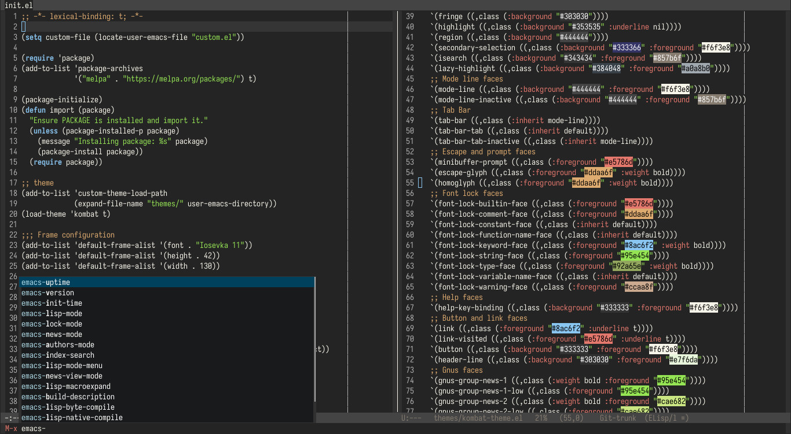

#+title: ~/.emacs.d

#+begin_quote
*Note:*

This config requires emacs v30.0 or higher
#+end_quote

#+CAPTION: Overview of my emacs

* Instalations

#+begin_src sh
$ git clone https://github.com/siarie/emacs.d.git ~/.emacs.d
$ emacs # open emacs
$ # wait until all package installed successfully
$ # it may take forever
#+end_src

* Licence

See [[./readme.org][LICENSE]]

